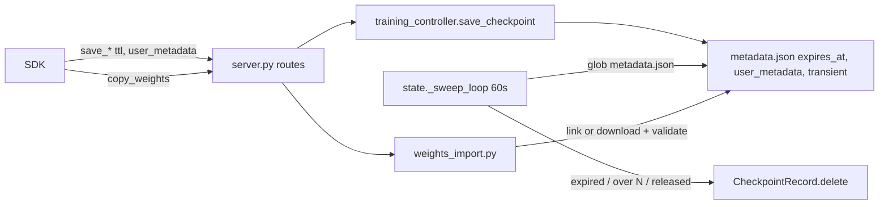

# Phase 6: Tinker API parity — design

**Status:** grilled
**Date:** 2026-10-07

## 1. Problem & context

The tinker-cookbook core recipes must run unchanged against this fork on tinker SDK 0.32
(TODO.md Phase 6). Research found that no core recipe calls an SDK method the fork lacks.
What is missing: proof that the recipes run, checkpoint lifecycle (TTL and disk growth from
unnamed sampler saves), adapter import, a few wire fields, and CI that exercises the real
server without a GPU. Scope rule: small diffs where value is highest, kept easy to merge
with `upstream`. Per-method SDK status lives in `docs/compatibility.md`.

## 2. Goals & non-goals

Goals
- `Integration tests (CPU)` workflow green on every PR: the SDK wiring test plus the 5 recipes
  chat_sl, math_rl `env=arithmetic`, DPO `dataset=hhh`, guess_number, on-policy distillation.
- Checkpoint TTL and GC, `user_metadata` on saves, listings after a restart without Redis.
- `copy_weights` with `tinker://`, `hf://` and `s3://` sources; imports train and sample.
- `topk_sample_logprobs`, model metadata, adapter capabilities.
- Fixes: tinker 0.32 lock, `weights_info` train flags, sampler name collision, HF rank guard.

Non-goals (moved to Phase 8 in TODO.md)
- `target_prompt_logprobs`, `prompt_alt_tokens_k`, external export (`save_weights_external`).
- `LoraConfig.seed`, logging SDK telemetry events, `get_current_checkpoint_storage_usage`.
- FSDP on CPU, a semver release (main publishes `dev` images), twenty_questions.
- Unloading staged adapter copies when their checkpoint expires.

## 3. Decisions (locked)

| # | Decision | Rationale | Lost alternative |
|---|---|---|---|
| D1 | Three PRs: PR 0 fixes, PR-A checkpoints, PR-B API surface + CPU CI | Fixes ship fast; two areas keep review whole | ~5 area PRs; one PR per item |
| D2 | Merge order PR 0 → PR-B → PR-A (proposed, not explicitly confirmed) | CPU CI guards the checkpoint work | PR-A first |
| D3 | Unnamed sampler saves: keep newest N per live run, delete all on run release | Bounds disk within and after a session | Only one of the two |
| D4 | N is config `sampler_checkpoints_keep` (default 2); a save still referenced by a live sampling session is never deleted | Async RL samples from older steps | Hard-coded 2 |
| D5 | TTL sweep extends `ServerState._sweep_loop`, 60 s, scans `metadata.json` on disk | Reuse; works without Redis | Lazy expiry on access |
| D6 | List endpoints fall back to a disk scan when a run is not in memory | Restart without Redis must list old runs | Require Redis |
| D7 | `copy_weights` sources: `tinker://` (needs `require_access`), `hf://`, `s3://` | Import external adapters | tinker-only |
| D8 | `s3://` only under config `import_s3_prefixes` (empty disables); boto3 default credential chain | Bounds what users reach with server credentials | Trust all users |
| D9 | `hf://` uses only the request `weights_access_token`; no env-token fallback | Users cannot read the server's private repos | Env fallback |
| D10 | boto3 is a core dependency | ~13 MB installed; images get it via pyproject | Optional extra |
| D11 | Copies use hard links with a real-copy fallback; `metadata.json` is written fresh | SDK promises no duplicated bytes | Plain copy |
| D12 | Imports require `adapter_model.safetensors` + `adapter_config.json`; `.bin` is never loaded | Pickle files run code | Accept `.bin` |
| D13 | Import validation: config (rank, alpha, targets) and tensor shapes vs the base model; 400 on mismatch | Fail at import, not at load | Config only |
| D14 | Imports train on both backends: FSDP loads `adapter_model.safetensors` when `adapter.pt` is absent | Import is useless if it cannot resume | Sampling only |
| D15 | `topk_sample_logprobs`: processed values (engine `logprobs_mode`), k ≤ 20 else 400; dummy backend returns fixed values | Matches sampled-token logprobs; e2e covers the wire | Configurable cap |
| D16 | Optional `ModelConfig.tokenizer_id` (default `model_name`); `arch` from model `config.json` | Aliases and local paths | Docs only |
| D17 | Capabilities: SDK `trainable`/`sampleable` plus extra keys `lora_ranks`, `lora_alpha`, `lora_alpha_ratio` | Clients fail before submit | Flags only |
| D18 | CPU CI: HF training backend on CPU, `TuFTCPUWorker` on the vLLM `0.28.0+cpu` wheel, tiny random Qwen3 with the real Qwen3 tokenizer | Real wiring in seconds | Qwen3-0.6B; FSDP on gloo |
| D19 | Separate workflow `Integration tests (CPU)` on every PR: SDK job + cookbook job | Visible, not mixed with lint/unit | Job in checks.yml |
| D20 | Cookbook pinned by SHA, own venv, real datasets with HF cache, `config/tuft_config.cookbook.yaml` (`max_lora_rank: 32`) | Unchanged recipes; upstream defaults untouched | Latest main; raise default rank |

## 4. Fact base (verified)

- Server parses requests with `uv.lock` tinker **0.28.1** (`uv.lock:5698`). SDK 0.29+ sends
  `topk_sample_logprobs=0` and `prompt_alt_tokens_k=0`, so a 0.28.1 `StrictBase` model answers 422
  (reported by research agent, reproduced in `.venv`). Images are not affected: they install from
  the `pyproject.toml` range (`docker/Dockerfile.train:58-60`, `docker/Dockerfile.infer:29-31`).
  CI pins one version for client and server in one Python (`.github/workflows/checks.yml:111`).
- `get_weights_info` returns only `base_model`, `is_lora`, `lora_rank` (`src/tuft/training_controller.py:1041-1053`);
  the metadata holds `train_attn/mlp/unembed` (`src/tuft/checkpoints.py:135-137`). The SDK fills missing flags with True.
- Unnamed saves are named `checkpoint-{counter:04d}` from two counters (training, sampler) in one run directory
  (`src/tuft/training_controller.py:693-700`); the directory is created with `exist_ok=True` (`src/tuft/checkpoints.py:431-434`).
- Saves write in place: FSDP `torch.save(..., path / "adapter.pt")` after `mkdir(exist_ok=True)`
  (`src/tuft/backends/fsdp_training_backend.py:710,747`); HF `save_pretrained` (`src/tuft/backends/hf_training_model.py:248-250`).
- FSDP load reads only `adapter.pt` (`src/tuft/backends/fsdp_training_backend.py:846`).
- Adapter compatibility check exists: `_check_adapter_compatible` (`src/tuft/training_controller.py:831`), called from `load_checkpoint` (`:816`).
- `CheckpointMetadata` has no `expires_at` or `user_metadata` (`src/tuft/checkpoints.py:115-147`);
  `save_metadata` at `:342`, `from_tinker_path` at `:383`, `delete` at `:415`.
- Save routes drop `ttl_seconds` and `user_metadata` (`src/tuft/server.py:501-560`; `grep ttl_seconds src/tuft/server.py` is empty).
- Sweep starts only when `session_heartbeat_ttl_minutes > 0` (`src/tuft/state.py:168`); loop and body at `:171-192`.
- `release_run` frees the adapter and keeps checkpoints (`src/tuft/training_controller.py:616-629`).
- Run records persist only to Redis (`_save_training_run`, `src/tuft/training_controller.py:301-307`); without Redis
  only `metadata.json` survives a restart.
- `load_checkpoint` checks access and adapter compatibility, not checkpoint type (`src/tuft/training_controller.py:786-829`);
  sampling sessions resolve any tinker path via `from_tinker_path` (`src/tuft/sampling_controller.py:250-270`).
- Sampling session records keep the adapter path in `model_path` (`src/tuft/sampling_controller.py:71`); `evict_session` at `:431`.
- Sample path passes only prompt-logprob args (`src/tuft/sampling_controller.py:390-397`); vLLM params hard-code
  `"logprobs": 0` (`src/tuft/backends/sampling_backend.py:334`); the three fields return 400 (`src/tuft/server.py:655-660`).
  Proto writer: `serialize_sample_response_proto` (`src/tuft/compat.py:488`).
- `get_model_info` hard-codes `arch="toy-transformer"`, `tokenizer_id=base_model` (`src/tuft/training_controller.py:651-664`).
- `build_supported_models` sets only name, context length, capabilities (`src/tuft/state.py:319-333`).
- `max_lora_rank` defaults to 16 (`src/tuft/config.py:103`); cookbook defaults to `lora_rank=32` (cookbook survey).
- HF backend: unguarded `torch.cuda.reset_peak_memory_stats()` (`src/tuft/backends/hf_training_model.py:412`); actor asks `num_gpus=1` (`:672-679`).
  Sampling actors ask GPUs too: `num_gpus=config.sampling_memory_fraction` (`src/tuft/backends/sampling_backend.py:186`) and
  `num_gpus=tensor_parallel_size` (`:236`).
- vLLM worker: `TuFTGPUWorker(VLLMGPUWorker)` (`src/tuft/backends/vllm_worker.py:164`), selected at `src/tuft/backends/vllm_engine.py:197`.
- vLLM 0.28 (source, per spike): `CPUModelRunner(GPUModelRunner)` does not override `_get_prompt_logprobs_dict`;
  custom `worker_cls` is honoured on CPU; `max_logprobs` defaults to 20. CPU wheel:
  `github.com/vllm-project/vllm/releases/download/v0.28.0/vllm-0.28.0+cpu-cp38-abi3-manylinux_2_34_x86_64.whl`
  (AVX2 kernels included). Smoke passed on macOS arm64 only; x86_64 and `LD_PRELOAD=libiomp5` unverified.
- `huggingface-hub` is already a dependency (`pyproject.toml:75`); boto3 is not.

## 5. Design

**PR 0: fixes**
- `uv.lock`: `tinker==0.32.0`. Correction at implementation: `uv.lock` is gitignored (`.gitignore:67`); the 0.28.1
  lock was local only, and a fresh `uv lock` resolves 0.32.0. PR 0 ships only the test. Test in a unit test file (not `test_tinker_sdk_e2e.py`, whose 0.25 CI leg rejects the
  fields): raw POST `/api/v1/asample` with `topk_sample_logprobs=0, prompt_alt_tokens_k=0` → 202.
- `get_weights_info` returns `train_attn/mlp/unembed` from metadata. Old checkpoints store `None`; the SDK then sends
  True, as today (accepted).
- Sampler counter names become `sampler-{counter:04d}`. Existing `checkpoint-NNNN` paths still resolve.
- HF `create_adapter`: rank > `max_lora_rank` → 400.

**PR-A: checkpoints**
- `CheckpointMetadata` and `CheckpointRecord` gain `expires_at: str | None`, `user_metadata: dict[str, str] | None`,
  `transient: bool = False`; `save_metadata` writes them from `self`; `tinker_checkpoint` returns them.
- `save_checkpoint(..., ttl_seconds, user_metadata)`; unnamed sampler saves set `transient=True`.
  Before writing, a save removes an existing target directory (unlink, never truncate a hard-linked file).
- `PUT /api/v1/training_runs/{id}/checkpoints/{cid}/ttl` body `{"ttl_seconds": int | null}`; owner only; null clears.
- Sweep: always start; interval `min(60, heartbeat TTL × 60 / 10)` s when heartbeat TTL > 0, else 60 s; the session part
  runs only when heartbeat TTL > 0.
  `_sweep_checkpoints()`: delete expired; per run delete transient beyond `sampler_checkpoints_keep`,
  skipping any whose adapter path a live sampling record holds; delete transient checkpoints whose run is not live
  (released, or not in memory after a restart).
- Listings: `list_checkpoints`, `get_training_run`, `list_user_checkpoints` read `metadata.json` from disk for runs
  not in memory. A disk `TrainingRun` takes `model_id`, `base_model`, `owner_name`, `lora_rank` and the newest
  `created_at` from its checkpoints. Run-level `user_metadata` (the cookbook `renderer_name`) is lost without Redis;
  the cookbook only warns on resume (accepted). `ponytail:` linear glob; index it if checkpoint counts reach the thousands.
- New fork module `src/tuft/weights_import.py`, one entry `import_weights(source_path, token, dest, base_model_cfg) -> None`:
  - `tinker://`: `require_access`, `copytree(copy_function=os.link)`, fallback `shutil.copy2` on `OSError`.
  - `hf://<repo>[@rev][/subdir]`: `snapshot_download(allow_patterns=["adapter_config.json","*.safetensors"], token=token)`.
  - `s3://bucket/key/`: allowed only when bucket equals an `import_s3_prefixes` entry's bucket and the key starts with
    that entry's key on a `/` boundary (entries normalized to end in `/`; `..` segments rejected); boto3 download of the two files.
  - Validate: both files present, no `.bin`; `_check_adapter_compatible` rules; rank in the backend's supported ranks;
    each `lora_A/B` shape vs the base module: build `AutoModelForCausalLM.from_config(AutoConfig.from_pretrained(model_path))`
    under `torch.device("meta")` and compare with `get_submodule(name).weight.shape` (needs only `config.json`).
    Any failure → 400, partial dir removed.
- `POST /api/v1/copy_weights` → new run with `released=True` (cannot train in place), checkpoint kind kept
  (`hf`/`s3` imports become `sampler` checkpoints; both load paths accept any type), sync response `{tinker_path}`.
  `load_state_with_optimizer` on a checkpoint without optimizer state → 400.
- FSDP `load_checkpoint`: if `adapter.pt` is absent, load `adapter/adapter_model.safetensors` via `safetensors.torch.load_file`.

**PR-B: API surface and CPU CI**
- `topk_sample_logprobs`: drop it from the 400 loop; pass `topk_sample_logprobs` through controller → `backend.sample`
  (Base, DP, Dummy signatures); vLLM `logprobs=k`; `_build_sample_response` slices top-k per position; `compat.py`
  writes `SampledSequence.topk_sampled_logprobs` (N×K, empty cells `0` / `-99999.0`, `-inf` clamped); k > 20 → 400.
- `get_model_info`: `arch` = `model_type` from `config.json` under `model_path` or None; `tokenizer_id` = `ModelConfig.tokenizer_id or model_name`.
- `build_supported_models`: `trainable`, `sampleable`, `lora_ranks`, `lora_alpha`, `lora_alpha_ratio`.
- CPU: guard `reset_peak_memory_stats` with `torch.cuda.is_available()`; `num_gpus=0` without CUDA at all three actor
  sites (`hf_training_model.py:673`, `sampling_backend.py:186`, `:236`);
  `TuFTCPUWorker(CPUWorker)` applying `patch_vllm_prompt_logprobs`; `worker_cls` chosen by `current_platform.is_cpu()`.
- Workflow `.github/workflows/integration-cpu.yml`, every PR, ubuntu-latest:
  - Server venv: `uv sync --extra dev --no-install-package vllm --no-install-package torch`, then the CPU wheel
    with `--torch-backend cpu`, `LD_PRELOAD` libiomp5, HF cache.
  - Job `sdk`: `pytest -m cpu_integration`, real server on the tiny model (built once from the Qwen3 config with tiny
    dims and the real tokenizer), SDK flow create → forward_backward → optim_step → save_weights_for_sampler →
    sample (LoRA, prompt and top-k logprobs) → save_state → load_state. PR-A adds a copy_weights step.
  - Job `cookbook`: second venv with the cookbook at a pinned SHA; server started with
    `config/tuft_config.cookbook.yaml` (HF-id names → tiny model paths, two names for distillation); each recipe
    1–2 steps, `renderer_name=qwen3`, smallest dataset split.

Upstream footprint

| File (upstream-owned) | PR | Approx. lines |
|---|---|---|
| `checkpoints.py` | A | +30 |
| `training_controller.py` | 0, A | +40 |
| `state.py` | A, B | +50 |
| `server.py` | 0, A, B | +40 |
| `backends/fsdp_training_backend.py`, `hf_training_model.py` | 0, A, B | +15 |
| `backends/sampling_backend.py`, `vllm_engine.py`, `vllm_worker.py`, `compat.py` | B | +60 |
| `config.py`, `pyproject.toml`, `uv.lock` | 0, A, B | +10 |
| New: `weights_import.py`, `integration-cpu.yml`, `tuft_config.cookbook.yaml`, tests | A, B | fork-owned |

## 6. Implementation phases

| # | PR | Increment | Green check |
|---|---|---|---|
| 1 | 0 | Lock bump, train flags, `sampler-NNNN`, HF rank guard | Raw-POST 202 test; from-state with `train_unembed=False` |
| 2 | B | Bare `integration-cpu.yml`: CPU wheel installs, one vLLM sample on the tiny model | Workflow green on ubuntu-latest; stop and re-plan if not |
| 3 | B | HF CPU backend + `TuFTCPUWorker` + SDK wiring test | `sdk` job green |
| 4 | B | `topk_sample_logprobs`, metadata, capabilities | Proto round-trip test; dummy e2e on 0.32 |
| 5 | B | Cookbook job + config profile | 5 recipes green |
| 6 | A | TTL, `user_metadata`, sweep, keep-N, listings from disk | Unit tests with a fake clock |
| 7 | A | `copy_weights` + import + FSDP safetensors load | Import tests: tinker, hf (mocked), s3 (mocked), `.bin` rejected, shape mismatch 400; `sdk` job copy step |
| 8 | all | `docs/compatibility.md`, README, TODO.md | `test_compat_matrix.py` green |

## 7. Decision log (2026-10-06 → 2026-10-07)

| Q | A |
|---|---|
| Done check | Cookbook tests; no release, `dev` tag only |
| Fixes PR first | Yes |
| PR split | Two big PRs (checkpoints vs API surface) |
| vLLM CPU worker | Spike first → spike feasible, kept |
| Scope rule | Small diffs, highest value, easy upstream sync |
| Deferred | target/alt logprobs, external export, seed, telemetry, storage usage |
| CPU CI shape | Both SDK test and cookbook; separate workflow, every PR |
| Tiny model / train backend | Tiny random Qwen3; HF backend only |
| Sampler saves / N | Keep N and delete on release; N is config |
| Sweep / listings / staged copies | Extend sweep loop; scan disk; idle unload |
| Schemes / trainable / copy / validation | tinker+hf+s3 (boto3); both backends; hard links; config + shapes, safetensors only |
| s3 creds / boto3 / import scope | Default chain; core dep; s3 allowlist, hf token per request |
| Top-k / tokenizer / caps / dummy | Processed cap 20; optional `tokenizer_id`; flags + ranks + alpha; dummy fixed values |
| Cookbook pin / data / rank | Pinned SHA; real datasets + cache; config profile |

## 8. Open questions

- Merge order D2 awaits explicit confirmation.
- Tiny model: build at test time vs a hub checkpoint; settle in phase 2 by measured CI time.
- Exact distillation dataset split small enough for every-PR runs; settle in phase 5.
